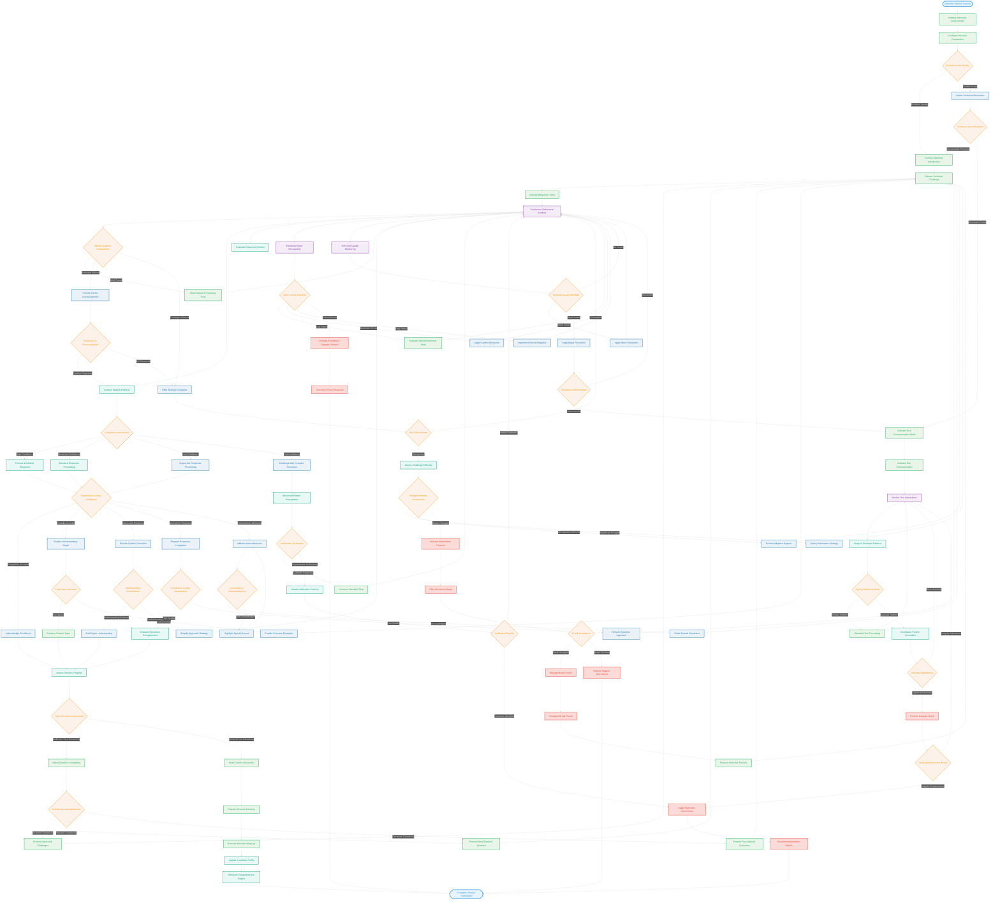

## Architecture

```mermaid
---
config:
  theme: dark
---
flowchart TD
    classDef startEnd fill:#e8f4fd,stroke:#3498db,stroke-width:2px,color:#3498db
    classDef process fill:#e8f5e8,stroke:#27ae60,stroke-width:2px,color:#27ae60
    classDef decision fill:#fdf2e9,stroke:#f39c12,stroke-width:2px,color:#f39c12
    classDef monitoring fill:#f4ecf7,stroke:#8e44ad,stroke-width:2px,color:#8e44ad
    classDef intervention fill:#eaf2f8,stroke:#2980b9,stroke-width:2px,color:#2980b9
    classDef emergency fill:#fadbd8,stroke:#e74c3c,stroke-width:2px,color:#e74c3c
    classDef analysis fill:#e8f8f5,stroke:#16a085,stroke-width:2px,color:#16a085
    START([Interview Session Launch]):::startEnd
    START --> INIT[Initialize Interview Environment]:::process
    INIT --> CONFIG[Configure Session Parameters]:::process
    CONFIG --> QUALITY_CHECK{Evaluate Audio Quality}:::decision
    QUALITY_CHECK -->|Excellent Quality| INTRODUCTION[Conduct Opening Introduction]:::process
    QUALITY_CHECK -->|Quality Issues| TECH_RESOLUTION[Initiate Technical Resolution]:::intervention
    TECH_RESOLUTION --> RESOLUTION_STATUS{Technical Issue Resolved}:::decision
    RESOLUTION_STATUS -->|Successfully Resolved| INTRODUCTION
    RESOLUTION_STATUS -->|Resolution Failed| TEXT_INTERFACE[Activate Text Communication Mode]:::process
    INTRODUCTION --> QUESTION_DELIVERY[Present Technical Challenge]:::process
    QUESTION_DELIVERY --> TIMER_START[Activate Response Timer]:::process
    TIMER_START --> BEHAVIORAL_MONITOR[Continuous Behavioral Analysis]:::monitoring
    BEHAVIORAL_MONITOR --> SILENCE_DETECTION{Silence Duration Assessment}:::decision
    BEHAVIORAL_MONITOR --> SPEECH_ANALYSIS[Analyze Speech Patterns]:::analysis
    BEHAVIORAL_MONITOR --> CONTENT_EVALUATION[Evaluate Response Content]:::analysis
    BEHAVIORAL_MONITOR --> EMOTIONAL_READING[Emotional State Recognition]:::monitoring
    BEHAVIORAL_MONITOR --> TECHNICAL_MONITORING[Technical Quality Monitoring]:::monitoring
    SILENCE_DETECTION -->|Brief Pause| NATURAL_WAIT[Allow Natural Processing Time]:::process
    SILENCE_DETECTION -->|Extended Silence| GENTLE_NUDGE[Provide Gentle Encouragement]:::intervention
    SILENCE_DETECTION -->|Prolonged Silence| STRATEGIC_HINT[Offer Strategic Guidance]:::intervention
    GENTLE_NUDGE --> NUDGE_RESPONSE{Response to Encouragement}:::decision
    STRATEGIC_HINT --> HINT_UTILIZATION{Hint Effectiveness}:::decision
    NUDGE_RESPONSE -->|Positive Response| SPEECH_ANALYSIS
    NUDGE_RESPONSE -->|No Response| STRATEGIC_HINT
    HINT_UTILIZATION -->|Hint Applied| BEHAVIORAL_MONITOR
    HINT_UTILIZATION -->|Hint Ignored| DIFFICULTY_ASSESSMENT[Assess Challenge Difficulty]:::analysis
    SPEECH_ANALYSIS --> CONFIDENCE_LEVEL{Confidence Assessment}:::decision
    CONFIDENCE_LEVEL -->|High Confidence| CONFIDENT_PROCESSING[Process Confident Response]:::analysis
    CONFIDENCE_LEVEL -->|Moderate Confidence| STANDARD_PROCESSING[Standard Response Processing]:::analysis
    CONFIDENCE_LEVEL -->|Low Confidence| SUPPORTIVE_PROCESSING[Supportive Response Processing]:::intervention
    CONFIDENCE_LEVEL -->|Overconfidence| CHALLENGE_RESPONSE[Challenge with Complex Scenarios]:::intervention
    CONFIDENT_PROCESSING --> ACCURACY_CHECK{Response Accuracy Verification}:::decision
    STANDARD_PROCESSING --> ACCURACY_CHECK
    SUPPORTIVE_PROCESSING --> ACCURACY_CHECK
    ACCURACY_CHECK -->|Completely Accurate| EXCELLENCE_RECOGNITION[Acknowledge Excellence]:::intervention
    ACCURACY_CHECK -->|Partially Accurate| DEPTH_EXPLORATION[Explore Understanding Depth]:::intervention
    ACCURACY_CHECK -->|Inaccurate Response| GUIDED_CORRECTION[Provide Guided Correction]:::intervention
    ACCURACY_CHECK -->|Incomplete Response| COMPLETION_REQUEST[Request Response Completion]:::intervention
    ACCURACY_CHECK -->|Contradictory Elements| CONSISTENCY_ADDRESS[Address Inconsistencies]:::intervention
    EMOTIONAL_READING --> STRESS_INDICATORS{Stress Level Detection}:::decision
    STRESS_INDICATORS -->|Low Stress| OPTIMAL_STATE[Maintain Optimal Interview State]:::process
    STRESS_INDICATORS -->|Moderate Stress| COMFORT_MEASURES[Apply Comfort Measures]:::intervention
    STRESS_INDICATORS -->|High Stress| STRESS_MITIGATION[Implement Stress Mitigation]:::intervention
    STRESS_INDICATORS -->|Critical Stress| EMERGENCY_SUPPORT[Activate Emergency Support Protocol]:::emergency
    DEPTH_EXPLORATION --> EXPLORATION_SUCCESS{Exploration Outcome}:::decision
    EXPLORATION_SUCCESS -->|Successful| TOPIC_CONTINUATION[Continue Current Topic]:::process
    EXPLORATION_SUCCESS -->|Unsuccessful| CONCRETE_EXAMPLES[Provide Concrete Examples]:::intervention
    GUIDED_CORRECTION --> CORRECTION_UNDERSTANDING{Understanding Achievement}:::decision
    CORRECTION_UNDERSTANDING -->|Understanding Achieved| KNOWLEDGE_BUILDING[Build Upon Understanding]:::intervention
    CORRECTION_UNDERSTANDING -->|Understanding Lacking| APPROACH_SIMPLIFICATION[Simplify Approach Strategy]:::intervention
    COMPLETION_REQUEST --> COMPLETION_QUALITY{Completion Quality Assessment}:::decision
    COMPLETION_QUALITY -->|High Quality| COMPLETENESS_EVALUATION[Evaluate Response Completeness]:::analysis
    COMPLETION_QUALITY -->|Low Quality| QUESTION_REFRAMING[Reframe Question Approach]:::intervention
    CONSISTENCY_ADDRESS --> ACKNOWLEDGMENT_CHECK{Inconsistency Acknowledgment}:::decision
    ACKNOWLEDGMENT_CHECK -->|Acknowledged| RESOLUTION_GUIDANCE[Guide Toward Resolution]:::intervention
    ACKNOWLEDGMENT_CHECK -->|Not Acknowledged| SPECIFIC_HIGHLIGHTING[Highlight Specific Issues]:::intervention
    CHALLENGE_RESPONSE --> PATTERN_RECOGNITION[Advanced Pattern Recognition]:::analysis
    PATTERN_RECOGNITION --> AUTHENTICITY_ASSESSMENT{Authenticity Evaluation}:::decision
    AUTHENTICITY_ASSESSMENT -->|Authentic Response| STANDARD_CONTINUATION[Continue Standard Flow]:::process
    AUTHENTICITY_ASSESSMENT -->|Questionable Authenticity| VERIFICATION_PROTOCOL[Initiate Verification Protocol]:::analysis
    VERIFICATION_PROTOCOL --> VERIFICATION_OUTCOME{Verification Results}:::decision
    VERIFICATION_OUTCOME -->|Verified Authentic| BEHAVIORAL_MONITOR
    VERIFICATION_OUTCOME -->|Concerns Identified| DIPLOMATIC_INTERVENTION[Apply Diplomatic Intervention]:::emergency
    EXCELLENCE_RECOGNITION --> SESSION_PROGRESS[Assess Session Progress]:::analysis
    TOPIC_CONTINUATION --> SESSION_PROGRESS
    KNOWLEDGE_BUILDING --> SESSION_PROGRESS
    COMPLETENESS_EVALUATION --> SESSION_PROGRESS
    SESSION_PROGRESS --> TIME_EVALUATION{Time Allocation Assessment}:::decision
    TIME_EVALUATION -->|Sufficient Time Remaining| COMPLEXITY_ADJUSTMENT[Adjust Question Complexity]:::process
    TIME_EVALUATION -->|Limited Time Remaining| CURRENT_WRAP[Wrap Current Discussion]:::process
    COMPLEXITY_ADJUSTMENT --> COMPLEXITY_DECISION{Complexity Appropriateness}:::decision
    COMPLEXITY_DECISION -->|Increase Complexity| ADVANCED_QUESTIONS[Present Advanced Challenges]:::process
    COMPLEXITY_DECISION -->|Maintain Complexity| NEXT_STANDARD[Present Next Standard Question]:::process
    COMPLEXITY_DECISION -->|Decrease Complexity| FOUNDATIONAL_QUESTIONS[Present Foundational Questions]:::process
    DIFFICULTY_ASSESSMENT --> STRUGGLE_LEVEL{Struggle Intensity Assessment}:::decision
    STRUGGLE_LEVEL -->|Manageable Difficulty| ADAPTIVE_SUPPORT[Provide Adaptive Support]:::intervention
    STRUGGLE_LEVEL -->|Significant Struggle| ALTERNATIVE_STRATEGY[Deploy Alternative Strategy]:::intervention
    STRUGGLE_LEVEL -->|Severe Struggle| INTERVENTION_PROTOCOL[Activate Intervention Protocol]:::emergency
    INTERVENTION_PROTOCOL --> BREAK_OFFERING[Offer Structured Break]:::emergency
    BREAK_OFFERING --> BREAK_DECISION{Break Acceptance}:::decision
    BREAK_DECISION -->|Break Accepted| BREAK_MANAGEMENT[Manage Break Period]:::emergency
    BREAK_DECISION -->|Break Declined| SUPPORT_ALTERNATIVES[Explore Support Alternatives]:::emergency
    BREAK_MANAGEMENT --> BREAK_COMPLETION[Complete Break Period]:::emergency
    BREAK_COMPLETION --> INTERVIEW_RESUMPTION[Resume Interview Process]:::process
    TEXT_INTERFACE --> TEXT_INITIALIZATION[Initialize Text Communication]:::process
    TEXT_INITIALIZATION --> TEXT_MONITORING[Monitor Text Interactions]:::monitoring
    TEXT_MONITORING --> INPUT_ANALYSIS[Analyze Text Input Patterns]:::analysis
    INPUT_ANALYSIS --> TYPING_PATTERNS{Typing Pattern Analysis}:::decision
    TYPING_PATTERNS -->|Normal Patterns| TEXT_STANDARD[Standard Text Processing]:::process
    TYPING_PATTERNS -->|Unusual Patterns| PATTERN_INVESTIGATION[Investigate Pattern Anomalies]:::analysis
    PATTERN_INVESTIGATION --> ANOMALY_ASSESSMENT{Anomaly Significance}:::decision
    ANOMALY_ASSESSMENT -->|Minor Anomaly| TEXT_MONITORING
    ANOMALY_ASSESSMENT -->|Significant Anomaly| INTEGRITY_CHECK[Perform Integrity Check]:::emergency
    INTEGRITY_CHECK --> INTEGRITY_RESULT{Integrity Assessment Result}:::decision
    INTEGRITY_RESULT -->|Integrity Maintained| TEXT_MONITORING
    INTEGRITY_RESULT -->|Integrity Compromised| DIPLOMATIC_INTERVENTION
    CURRENT_WRAP --> SUMMARY_PREPARATION[Prepare Session Summary]:::process
    SUMMARY_PREPARATION --> WRAP_UP_EXECUTION[Execute Interview Wrap-up]:::process
    WRAP_UP_EXECUTION --> PROFILE_UPDATING[Update Candidate Profile]:::analysis
    PROFILE_UPDATING --> REPORT_GENERATION[Generate Comprehensive Report]:::analysis
    REPORT_GENERATION --> SESSION_CLOSURE([Complete Session Termination]):::startEnd
    ADVANCED_QUESTIONS --> QUESTION_DELIVERY
    NEXT_STANDARD --> QUESTION_DELIVERY
    FOUNDATIONAL_QUESTIONS --> QUESTION_DELIVERY
    ADAPTIVE_SUPPORT --> QUESTION_DELIVERY
    ALTERNATIVE_STRATEGY --> QUESTION_DELIVERY
    CONCRETE_EXAMPLES --> QUESTION_DELIVERY
    QUESTION_REFRAMING --> QUESTION_DELIVERY
    RESOLUTION_GUIDANCE --> QUESTION_DELIVERY
    SPECIFIC_HIGHLIGHTING --> CONSISTENCY_ADDRESS
    INTERVIEW_RESUMPTION --> QUESTION_DELIVERY
    NATURAL_WAIT --> BEHAVIORAL_MONITOR
    OPTIMAL_STATE --> BEHAVIORAL_MONITOR
    COMFORT_MEASURES --> BEHAVIORAL_MONITOR
    STRESS_MITIGATION --> BEHAVIORAL_MONITOR
    APPROACH_SIMPLIFICATION --> BEHAVIORAL_MONITOR
    STANDARD_CONTINUATION --> BEHAVIORAL_MONITOR
    TEXT_STANDARD --> TEXT_MONITORING
    SUPPORT_ALTERNATIVES --> SESSION_CLOSURE
    TECHNICAL_MONITORING --> TECH_ISSUE_DETECTED{Technical Issues Identified}:::decision
    TECH_ISSUE_DETECTED -->|No Issues| BEHAVIORAL_MONITOR
    TECH_ISSUE_DETECTED -->|Minor Issues| MINOR_RESOLUTION[Apply Minor Resolution]:::intervention
    TECH_ISSUE_DETECTED -->|Major Issues| MAJOR_RESOLUTION[Apply Major Resolution]:::intervention
    MINOR_RESOLUTION --> BEHAVIORAL_MONITOR
    MAJOR_RESOLUTION --> RESOLUTION_SUCCESS{Resolution Effectiveness}:::decision
    RESOLUTION_SUCCESS -->|Successful| BEHAVIORAL_MONITOR
    RESOLUTION_SUCCESS -->|Unsuccessful| TEXT_INTERFACE
    EMERGENCY_SUPPORT --> CRISIS_DOCUMENTATION[Document Crisis Response]:::emergency
    DIPLOMATIC_INTERVENTION --> INCIDENT_DOCUMENTATION[Document Intervention Details]:::emergency
    CRISIS_DOCUMENTATION --> SESSION_CLOSURE
    INCIDENT_DOCUMENTATION --> SESSION_CLOSURE
```